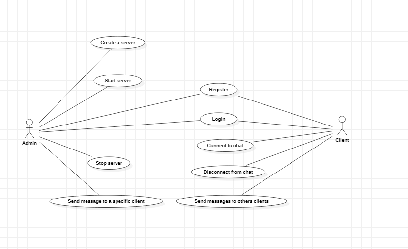

# ChatAPP

## Descriere
Si-ar imagina cineva viata in ziua de astazi fara WhatsApp, Facebook Messenger, SnapChat, Discord sau orice alta aplicatie de chat existenta? Ei bine, probabil ca nu. Tocmai de aceea, tema pe care noi am ales-o pentru acest proiect este realizarea unei aplicatii de chat, in care vom incerca sa implementam tehnologii deja existente, dar si sa venim cu idei noi, pe care le consideram inovatoare. Aplicatiile de chat sunt intr-o continua dezvoltare si ofera utilizatorului din ce in ce mai multe functionalitati, astfel acestea reprezinta o provocare pentru viitor, o provocare la care noi vrem sa luam parte. Vom incerca asadar, si sa gasim lipsurile aplicatiilor de chat actuale, functionalitati pe care noi le consideram a fi utile in viitor si sa venim cu solutii care poate vor ajunge sa fie implementate la scara larga.
Vom crea o aplicatie de chat intre doi utilizatori. Acestia se vor inregistra in aplicatie, iar mai apoi, cu ajutorul user-ului si al parolei, vor intra in cont. Aplicatia este conectata la o baza de date, unde vom stoca informatiile necesare despre utilizatori. Acestia vor putea comunica cu ajutorul unui protocol TCP, in timp real.

### UseCaseDiagram

 
### ClassDiagram

 
 
### DBDiagram

 
